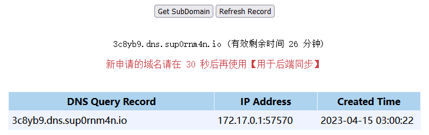

## DNSLOG 容器

> 依赖 Redis 作为数据存储

#### 0x1.构建

```
sudo docker build -t xlogf:0.3 .
```

#### 0x2.启动，设置环境变量

- REDIS_HOST
- REDIS_PORT
- LISTEN_DOMAIN 解析的域名前缀

```
sudo docker run -it -d -p 53:53/udp -p 80:80 -e REDIS_HOST="172.17.0.1" -e REDIS_PORT=6379 -e LISTEN_DOMAIN="dns.sup0rnm4n.io" -v /home/vagrant/dlogs:/usr/src/app/logs:rw xlogf:0.3
```

#### 0x3.测试

　　WEB 接口 http://127.0.0.1:80/xlogf/




```
dig @127.0.0.1 -p 53 a 3c8yb9.dns.sup0rnm4n.io

; <<>> DiG 9.11.3-1ubuntu1.16-Ubuntu <<>> @127.0.0.1 -p 53 a 3c8yb9.dns.sup0rnm4n.io
; (1 server found)
;; global options: +cmd
;; Got answer:
;; ->>HEADER<<- opcode: QUERY, status: NOERROR, id: 5484
;; flags: qr ra; QUERY: 1, ANSWER: 1, AUTHORITY: 0, ADDITIONAL: 0

;; QUESTION SECTION:
;3c8yb9.dns.sup0rnm4n.io.       IN      A

;; ANSWER SECTION:
3c8yb9.dns.sup0rnm4n.io. 0      IN      A       127.0.0.1

;; Query time: 4 msec
;; SERVER: 127.0.0.1#53(127.0.0.1)
;; WHEN: Sat Apr 15 03:00:22 UTC 2023
;; MSG SIZE  rcvd: 57
```

#### 0x5.本地日志 

 　　`cat /home/vagrant/dlogs/XLogf.log`

```
2023-04-15 03:00:22 - XLogf -> 3c8yb9.dns.sup0rnm4n.io, A, 172.17.0.1:57570, 2023-04-15 03:00:22
```

